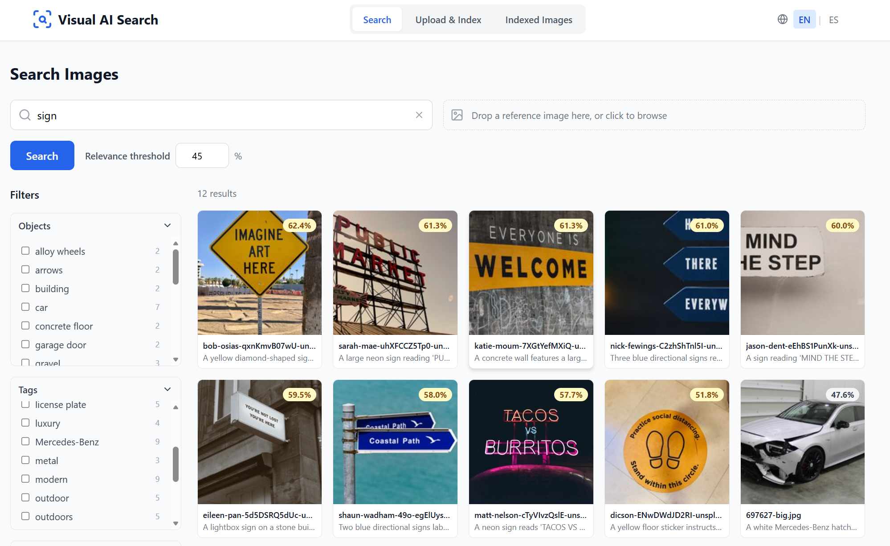
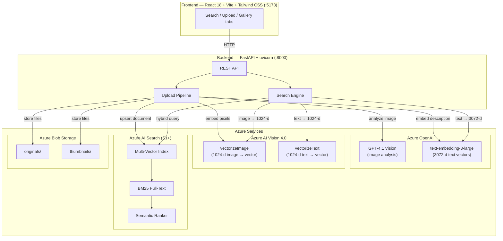
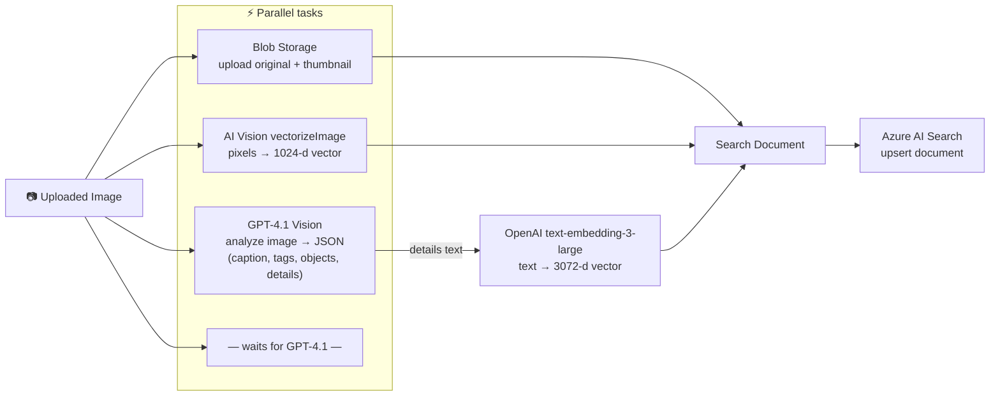
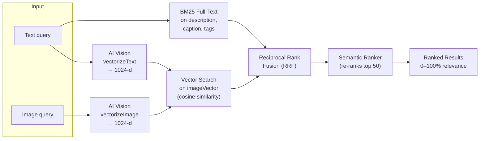
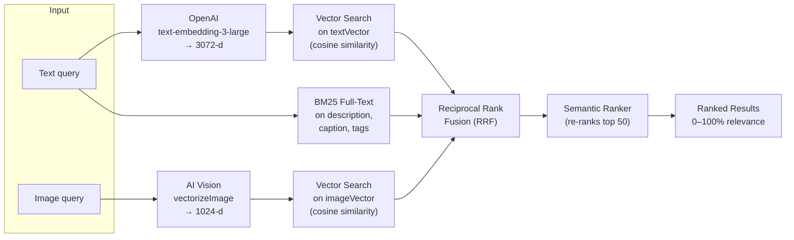

# Visual AI Search

Image search application with **dual vectorization** — compare **Azure AI Vision** multimodal embeddings vs **Azure OpenAI** text embeddings side-by-side. Uploaded images are analyzed by **GPT-4.1 Vision** with a fully customizable prompt, enabling domain-specific metadata extraction (damage detection, brand identification, condition assessment, etc.).

---

<p align="center">
  
</p>

---

## Features

| Feature | Description |
|---------|-------------|
| **Upload & Index** | Drag-and-drop images → GPT-4.1 Vision analysis (caption, tags, objects, detailed description) → dual vectorization → indexed in Azure AI Search |
| **Text Search** | Free-text queries with semantic re-ranking for high-quality results |
| **Visual Search** | Upload a reference image to find visually similar images |
| **Hybrid Search** | Combine text + image queries — vector search + BM25 + Semantic Ranker |
| **Strategy Comparison** | Side-by-side results: AI Vision (1024-d multimodal) vs OpenAI (3072-d text semantic) |
| **Configurable Strategy** | Show all strategies or lock to a single one via `SEARCH_STRATEGY` |
| **Semantic Ranking** | Azure AI Search Semantic Ranker re-ranks hybrid results using a language model |
| **Gallery Management** | Browse indexed images with thumbnails, view full metadata, delete one or all |
| **Unified Detail View** | Same rich image detail modal in both Search and Gallery (caption, description, tags, objects, metadata) |
| **Faceted Filtering** | Filter results by tags, objects, file type |
| **Pagination** | 10 / 20 / 50 / 100 results per page |
| **i18n** | English / Spanish toggle |
| **Customizable Analysis** | Edit `IMAGE_ANALYSIS_PROMPT` in `gpt_analysis.py` to adapt extraction to any domain |
| **Eager Initialization** | All credentials, HTTP clients, and tokens are warmed up at startup — zero cold-start latency |

---

## Architecture

### High-Level Architecture Diagram



> **Tip:** GitHub and VS Code render Mermaid diagrams natively. If viewing in a Markdown renderer without Mermaid support, install a Mermaid plugin or paste the block into [mermaid.live](https://mermaid.live).

### Index Schema

The Azure AI Search index stores **two independent vector fields** alongside traditional searchable text fields:

| Field | Type | Purpose |
|-------|------|---------|
| `imageVector` | `Collection(Single)` — 1024-d | AI Vision multimodal embedding of the **raw image pixels** |
| `textVector` | `Collection(Single)` — 3072-d | OpenAI embedding of the **GPT-4.1 text description** |
| `description` | `Edm.String` (searchable) | Full text description by GPT-4.1 (used by BM25 + Semantic Ranker) |
| `caption` | `Edm.String` (searchable) | One-sentence caption by GPT-4.1 |
| `tags` | `Collection(Edm.String)` (filterable, facetable) | Keywords extracted by GPT-4.1 |
| `objects` | `Collection(Edm.String)` (filterable, facetable) | Objects detected by GPT-4.1 |
| `thumbnailUrl` / `originalUrl` | `Edm.String` | Blob Storage URLs (SAS tokens generated on-the-fly) |

Each vector field has its own **HNSW index** (cosine metric, efConstruction=400, efSearch=500) and its own **vector search profile**, allowing them to be queried independently.

---

## Indexing Pipeline (Upload)

When a user uploads an image, the backend runs a **parallel pipeline** that produces both vector representations:



### Step-by-step

| Step | Service | What happens | Output |
|------|---------|-------------|--------|
| **1** | **Blob Storage** | Original image + auto-generated JPEG thumbnail are uploaded to two private containers (`originals/`, `thumbnails/`). | `originalUrl`, `thumbnailUrl` |
| **2** | **GPT-4.1 Vision** | The image is sent to GPT-4.1 with a customizable system prompt (`IMAGE_ANALYSIS_PROMPT`). The model returns structured JSON. | `caption`, `tags`, `objects`, `details` |
| **3** | **AI Vision 4.0** `vectorizeImage` | The raw image pixels are sent to the AI Vision multimodal embedding model, which produces a **1024-dimensional** vector that encodes both visual appearance and semantic content. | `imageVector` (1024-d) |
| **4** | **OpenAI** `text-embedding-3-large` | A text representation is built by concatenating `caption + tags + objects + details` from step 2. This rich text is then embedded into a **3072-dimensional** vector. | `textVector` (3072-d) |
| **5** | **Azure AI Search** | All fields — metadata, text, both vectors, and blob URLs — are upserted as a single document into the multi-vector index. | Indexed document |

> Steps 1–3 run **in parallel** (`asyncio.gather`). Step 4 depends on step 2 (needs the GPT output). Step 5 depends on all previous steps.

### Why Two Vectors?

| | Strategy A — AI Vision Multimodal (1024-d) | Strategy B — OpenAI Text Semantic (3072-d) |
|---|---|---|
| **What is embedded** | Raw image pixels | GPT-4.1 detailed text description |
| **Embedding model** | Azure AI Vision `vectorizeImage` | `text-embedding-3-large` |
| **Encodes** | Visual features (colors, shapes, layout, objects) | Semantic meaning of the *description* (concepts, relationships, context) |
| **Customizable** | No — the vision model is a black box | Yes — edit `IMAGE_ANALYSIS_PROMPT` to focus on your domain (damage detection, retail products, medical imaging, etc.) |
| **Best for** | "Find images that *look like* this" | "Find images that *mean* something similar to this concept" |

---

## Search Pipeline

### Strategy A — AI Vision Multimodal

Uses the **same** embedding model for both text and image queries, operating in a shared 1024-d vector space:



**How it works:**
1. **Text query** → AI Vision `vectorizeText` → 1024-d vector → cosine search on `imageVector`.
2. **Image query** → AI Vision `vectorizeImage` → 1024-d vector → cosine search on `imageVector`.
3. The text query *also* runs as a **BM25 full-text search** against `description`, `caption`, and `tags`.
4. **RRF** (Reciprocal Rank Fusion) merges the vector and BM25 result lists.
5. **Semantic Ranker** (when text is present) re-ranks the top 50 results using a language model that evaluates whether the document's `description`, `caption`, and `tags` genuinely match the query.

**Key insight:** Because AI Vision encodes images and text into the **same multimodal vector space**, a text query like `"red sports car"` can find images of red sports cars *even if the GPT description never mentions those exact words*.

### Strategy B — OpenAI Text + Vision Image

Uses a **higher-dimensional** text embedding (3072-d) for text queries, falling back to AI Vision for image queries:



**How it works:**
1. **Text query** → OpenAI `text-embedding-3-large` → 3072-d vector → cosine search on `textVector`.
2. **Image query** → AI Vision `vectorizeImage` → 1024-d vector → cosine search on `imageVector` (same as Strategy A — there is no OpenAI image embedding).
3. BM25 full-text + RRF + Semantic Ranker work exactly the same as Strategy A.

**Key insight:** Because `textVector` was built from a *GPT-4.1 description* and the query is embedded with the *same OpenAI model*, this strategy excels at **conceptual and semantic matching**. The GPT prompt is customizable, so the `details` field can emphasize domain-specific attributes (e.g., damage severity, brand identification) that drive better search relevance in your specific use case.

### Compare Mode

When the user selects **Compare both**, the backend:
1. Pre-computes **all needed vectors in parallel** (Vision text 1024-d + OpenAI text 3072-d + Vision image 1024-d).
2. Runs **both strategy queries in parallel** (`asyncio.gather`).
3. Returns two independent result sets that the frontend renders side-by-side, so the user can evaluate which strategy works better for their query.

### Score Normalization

The backend normalizes Azure AI Search scores to a 0–100% relevance scale, adapting to the scoring mode:

| Mode | Raw score range | Normalization |
|------|----------------|---------------|
| **Semantic** (reranker) | 0 – 4 | `score / 4 × 100` |
| **Vector-only** (cosine) | 0 – 1 | `score × 100` |
| **Hybrid** (RRF) | 0 – N/61 | `score / (N/61) × 100` |
| **BM25** (full-text only) | 0 – ∞ | `score/(1+score) × 100` (sigmoid) |

When Semantic Ranker is active, `@search.reranker_score` takes precedence over `@search.score`.

---

## Project Structure

```
visual_ai_search/
├── backend/
│   ├── app/
│   │   ├── config.py                 # Pydantic Settings (reads .env from project root)
│   │   ├── main.py                   # FastAPI app + lifespan (eager init + warm-up)
│   │   ├── routers/
│   │   │   ├── upload.py             # POST /api/upload
│   │   │   ├── search.py             # POST /api/search, GET /api/facets
│   │   │   └── documents.py          # GET/DELETE /api/documents
│   │   ├── services/
│   │   │   ├── vision.py             # AI Vision 4.0 (analyze, vectorize) + token warm-up
│   │   │   ├── openai_embeddings.py  # text-embedding-3-large + token warm-up
│   │   │   ├── gpt_analysis.py       # ★ GPT-4.1 Vision — customizable prompt + token warm-up
│   │   │   ├── search.py             # Query execution (hybrid + semantic ranking)
│   │   │   ├── search_index.py       # Index schema + Semantic Configuration
│   │   │   └── blob_storage.py       # Blob upload + SAS URL refresh
│   │   └── utils/
│   │       ├── helpers.py             # ID generation, text representation
│   │       └── thumbnails.py          # Thumbnail + resize for vectorization
│   ├── requirements.txt
│   └── logs/                          # Rotating log files (auto-created)
├── frontend/
│   └── src/
│       ├── App.tsx                    # Three-tab layout (Search / Upload / Gallery)
│       ├── components/
│       │   ├── Search/                # Search tab
│       │   │   ├── SearchTab.tsx      # Main search orchestrator (loads config)
│       │   │   ├── StrategySelector.tsx # Vision / OpenAI / Compare toggle
│       │   │   ├── TextSearchBar.tsx  # Text input
│       │   │   ├── ImageSearchInput.tsx # Image drop zone
│       │   │   ├── ResultsGrid.tsx    # Grid of ResultCards
│       │   │   ├── ResultCard.tsx     # Image thumbnail + relevance badge
│       │   │   ├── CompareView.tsx    # Side-by-side strategy results
│       │   │   ├── FacetPanel.tsx     # Sidebar with filter facets
│       │   │   ├── FacetGroup.tsx     # Single facet accordion
│       │   │   └── Pagination.tsx     # Page controls + page size selector
│       │   ├── Upload/
│       │   │   └── UploadTab.tsx      # Drag-and-drop upload
│       │   ├── Gallery/
│       │   │   ├── GalleryTab.tsx     # Thumbnail grid + pagination + delete
│       │   │   └── DocumentCard.tsx   # Gallery thumbnail card
│       │   ├── Layout/
│       │   │   └── Header.tsx         # App header + tab navigation
│       │   └── common/
│       │       ├── ImageDetailModal.tsx # ★ Unified detail modal (Search + Gallery)
│       │       ├── LanguageToggle.tsx  # EN / ES switch
│       │       └── Spinner.tsx         # Loading indicator
│       ├── services/api.ts            # Axios HTTP client
│       ├── types/index.ts             # TypeScript interfaces
│       └── i18n/                      # en.json, es.json
├── images/                            # Sample images for testing
│   ├── jpg-landmarks/
│   └── jpg-signs/
├── .env.example                       # Template — copy to .env
├── .env                               # ← Your credentials (not committed)
├── start_backend.bat                  # Quick-start: backend
├── start_frontend.bat                 # Quick-start: frontend
├── deploy.ps1                         # Docker local / Azure Container Apps
├── Dockerfile                         # Multi-stage (frontend build + backend)
└── README.md
```

---

## Quick Start

### 1. Prerequisites

- **Python 3.11+**
- **Node.js 20+**
- [Azure CLI](https://aka.ms/installazurecliwindows) logged in (`az login`)

**Azure resources:**

| Resource | SKU | Purpose |
|----------|-----|---------|
| Azure AI Search | **Standard S1+** | Multi-vector index + Semantic Ranker |
| Azure AI Vision | S1 | Image analysis + multimodal embeddings (1024-d) |
| Azure OpenAI | — | `text-embedding-3-large` + `gpt-4.1` deployments |
| Azure Blob Storage | — | Image and thumbnail storage |

**RBAC roles** (on your Azure AD user):

| Role | Resource |
|------|----------|
| **Cognitive Services OpenAI User** | Azure OpenAI |
| **Cognitive Services User** | Azure AI Vision |

> The deploy script (`deploy.ps1`) can assign these roles automatically.

### 2. Enable Semantic Ranker

In the Azure Portal, navigate to your **AI Search resource → Settings → Semantic ranker** and set it to **Free** (1,000 queries/month, no extra cost) or **Standard** (unlimited, pay per query).

### 3. Configure

```powershell
copy .env.example .env
```

Edit `.env` with your values:

```dotenv
# Azure AI Search
AZURE_SEARCH_ENDPOINT=https://<search-name>.search.windows.net
AZURE_SEARCH_API_KEY=<key>
AZURE_SEARCH_INDEX_NAME=visual-search-index

# Azure Tenant (optional — only needed if you have multiple tenants)
# AZURE_TENANT_ID=<tenant-id>

# Azure AI Vision — uses AzureCliCredential (Entra ID), no API key needed
AZURE_VISION_ENDPOINT=https://<vision-name>.cognitiveservices.azure.com

# Azure OpenAI — uses AzureCliCredential (Entra ID), no API key needed
AZURE_OPENAI_ENDPOINT=https://<openai-name>.openai.azure.com
AZURE_OPENAI_EMBEDDING_DEPLOYMENT=text-embedding-3-large
AZURE_OPENAI_CHAT_DEPLOYMENT=gpt-4.1

# Azure Blob Storage
AZURE_STORAGE_CONNECTION_STRING=DefaultEndpointsProtocol=https;AccountName=...

# Search strategy shown in frontend: "all" (show strategy selector), "vision", or "openai"
SEARCH_STRATEGY=all
```

### 4. Run (Development)

**Quick start (Windows):**
```powershell
.\start_backend.bat   # Terminal 1 — FastAPI on :8000
.\start_frontend.bat  # Terminal 2 — Vite on :5173
```

**Or manually:**

```powershell
# Backend
cd backend
pip install -r requirements.txt
uvicorn app.main:app --reload --port 8000

# Frontend (separate terminal)
cd frontend
npm install
npm run dev
```

Open **http://localhost:5173**

### 5. Deploy

```powershell
.\deploy.ps1
# Option 1 → Docker local
# Option 2 → Azure Container Apps
```

---

## Usage Guide

### Uploading Images

1. Navigate to the **Upload & Index** tab.
2. Drag & drop images (or click to browse). Multiple files supported.
3. Click **Upload & Index**. For each image the backend:
   - Generates a thumbnail and uploads both original + thumbnail to Blob Storage.
   - Calls **GPT-4.1 Vision** to extract caption, tags, objects, and a detailed description.
   - Calls **AI Vision** to generate a 1024-d multimodal embedding from the image pixels.
   - Calls **OpenAI text-embedding-3-large** to generate a 3072-d embedding from the GPT description.
   - Indexes everything into Azure AI Search.

### Searching

1. Navigate to the **Search** tab.
2. Enter a text query, drop a reference image, or both.
3. Choose a strategy (if the selector is visible):
   - **AI Vision (multimodal)** — Uses AI Vision 1024-d vectors. Best for visual similarity.
   - **OpenAI Text + Vision Image** — Uses OpenAI 3072-d text vectors for text queries, AI Vision 1024-d for image queries. Best for semantic/conceptual search.
   - **Compare both** — Shows results side-by-side.
4. Click **Search**.
5. Use the **Filters** sidebar to narrow results by tags, objects, or file type.
6. Click any result to open the full detail modal with all metadata.

### Browsing Indexed Images

1. Navigate to the **Indexed Images** tab.
2. Browse all images as a thumbnail grid with pagination.
3. Click any image to open the detail modal showing: caption, GPT description, tags, objects, dimensions, file size, upload date.
4. Delete individual images or all at once.

### Configuring Search Strategy

Set `SEARCH_STRATEGY` in `.env` to control what the frontend shows:

| Value | Behavior |
|-------|----------|
| `all` | Full strategy selector visible (Vision / OpenAI / Compare) |
| `vision` | Strategy selector hidden, all searches use AI Vision |
| `openai` | Strategy selector hidden, all searches use OpenAI |

This requires a backend restart. The frontend reads the config from `GET /api/config` on load.

---

## Customizing Image Analysis

The GPT-4.1 Vision prompt is defined as a constant in `backend/app/services/gpt_analysis.py`:

```python
IMAGE_ANALYSIS_PROMPT = """\
You are an expert image analyst.  Examine the provided image and return a
JSON object with the following keys:
{
  "caption": "A single sentence describing the image.",
  "tags": ["keyword1", "keyword2", "..."],
  "objects": ["object1", "object2", "..."],
  "details": "A detailed paragraph describing everything relevant you see."
}
...
"""
```

**To customize**, edit the prompt to focus on your domain. Examples:

- **Vehicle damage**: *"Pay special attention to scratches, dents, missing parts, rust, cracked glass…"*
- **Retail products**: *"Identify brand, product category, price tags, shelf position…"*
- **Construction sites**: *"Note safety equipment, materials, progress stage, hazards…"*
- **Medical imaging**: *"Describe visible abnormalities, measurements, tissue types…"*

The `details` field is the most important — it gets embedded by `text-embedding-3-large` for semantic search. The richer the description, the better the search results.

The model name is configurable via `AZURE_OPENAI_CHAT_DEPLOYMENT` in `.env` (default: `gpt-4.1`).

---

## API Endpoints

| Method | Path | Description |
|--------|------|-------------|
| `POST` | `/api/upload` | Upload image(s) → GPT analysis → dual vectorization → index |
| `POST` | `/api/search` | Search (text, image, or hybrid) with semantic re-ranking |
| `GET` | `/api/facets` | Get facet values (tags, objects, contentType) |
| `GET` | `/api/documents?page=1&page_size=50` | List indexed documents (paginated) |
| `DELETE` | `/api/documents/{id}` | Delete one document + blobs |
| `DELETE` | `/api/documents` | Delete all documents + blobs |
| `GET` | `/api/config` | Frontend configuration (search strategy) |
| `GET` | `/api/health` | Health check |

---

## Performance

All services are **eagerly initialized at startup** with full warm-up:

| Service | Warm-up |
|---------|---------|
| Azure AI Vision | Credential + token acquisition + TCP/TLS connection probe |
| Azure OpenAI (embeddings) | Credential + token acquisition |
| Azure OpenAI (GPT-4.1) | Credential + token acquisition |
| Azure AI Search | Client creation + index schema validation |
| Azure Blob Storage | Client creation + SAS token cache |

This eliminates cold-start latency on the first request.

| Operation | Typical Latency |
|-----------|----------------|
| Text search (with semantic re-ranking) | ~300–500 ms |
| Image search (vector only) | ~400 ms |
| Comparison mode (both strategies in parallel) | ~300 ms |
| Upload + GPT analysis + dual vectorization + indexing | ~3–5 s per image |

---

## Tech Stack

**Backend:** Python 3.11+ · FastAPI · uvicorn · httpx · openai · azure-identity · azure-search-documents · azure-storage-blob · Pillow · pydantic-settings

**Frontend:** React 18 · TypeScript 5.5 · Vite · Tailwind CSS 3.4 · axios · lucide-react · react-i18next

**Azure:** AI Search (Standard S1+ with Semantic Ranker) · AI Vision 4.0 · OpenAI (GPT-4.1 + text-embedding-3-large) · Blob Storage

---

## License

Internal demo — not for redistribution.
